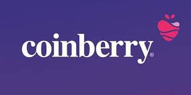
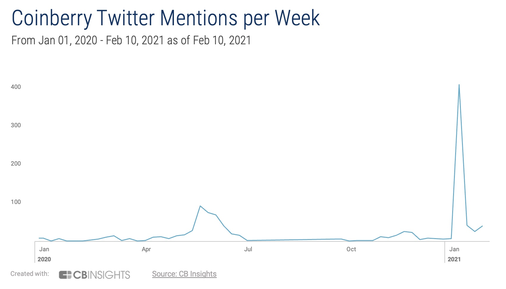

# Case Study 1 - UofT SCS - FinTech

# Overview and Origin

## Coinberry Limited

[Coinberry](https://www.coinberry.com/)

When was the company incorporated?

* Coinberry was incorporated on July 9, 2017 in Toronto, ON.  Coinberry is insured by Lloyd's of London and partnered with Gemini Trust Co. for crypto custody. 

Who are the founders of the company?

* Coinberry was founded by Andrei Poliakov (current CEO & Co-founder) and Evan Kuhn.  The company is relatively small and reports to have between 11 and 50 employees.

How did the idea for the company (or project) come about?

* Coinberry is a Toronto-based, FINTRAC-registered, financial technology solutions provider focused on blockchain and digital currency solutions. Coinberry operates the Coinberry.com cryptocurrency trading platform, offering members the safest and simplest way to buy, sell, and process payments made with Bitcoin, and other cryptocurrencies in Canada.
Coinberry also offers a desktop and mobile version of it's online crypto trading platform.

How is the company funded? How much funding have they received?
* Coinberry is privately held and does not report funding and financing structure publicly.  However, Coinberry did report receiving a grant from National Research Council of Canada on August 26, 2019, the details of which were not disclosed.

## Business Activities:

What specific financial problem is the company or project trying to solve?
* Coinberry is offering Canadian customers a simple low fee cryptocurreny trading platform for six major crytocurrencies:

1. Bitcoin
2. Ethereum
3. Litecoin
4. Ripple
5. Bitcoin Cash
6. Stellar
* Coinberry is allowing it's Canadian customers to securely, quickly and confidently hold (HODL) crypto currencies.  Coinberry business model is to secure crypto assets on the large markets and sell them back to it's users at a slightly higher price allowing them to make margin on the "spread".
* Coinberry is now backed by a financial institution bond, a form of insurance, that protects against financial losses due to dishonest acts and unethical behavior from Coinberry employees.

Who is the company's intended customer?  Is there any information about the market size of this set of customers?
* Coinberry is focused on the retail crypto market.  Generally, Coinberry customers are new entrants with little to know prior experience in financial or crypto markets.  Coinberry does not disclose details about customer base; however it was reported that on January 19, 2019 that Coinberry has secured a partnership with Swiss-based cryptocurrency wallet giant BRD.  This partnership resulted in 1.2million existing BRD customers to be introduced to Coinberry trading platform.

What solution does this company offer that their competitors do not or cannot offer? (What is the unfair advantage they utilize?)
* Coinberry allows Canadian customers to easily e-transfer, wire transfer or fund their accounts with cyrpto transfers.   

Which technologies are they currently using, and how are they implementing them? (This may take a little bit of sleuthing–– you may want to search the company’s engineering blog or use sites like Stackshare to find this information.)
* Coinberry reports on Stackshare to use the following technologies:

| Stack| Description |
| ----------- | ----------- |
| Application and Data | JavaScript, Ruby, Haskell & Google Cloud Platform |
| Utilities| WiX |
| DevOps | RequireJS |
| Business Tools | Google Fonts |
* In addition, Coinberry reports employing "banking grade" encryption technology for securing all transcations.

## Landscape:
What domain of the financial industry is the company in?

* Coinberry leads Canada as the only blockchain based cryptocurrency platform to provide payment processing for government municipalities, enterprise and retail clients alike.  Coinberry was the first digital currency platform to partner with a Municipal Government for Bitcoin tax payment processing in Canada, following the introduction of Bitcoin property tax payment processing in the Town of Innisfil and the City of Richmond Hill.
Coinberry’s partnership with Cyclebit allows real world POS transactions to take place via cryptocurrency at any accepting retailer.
Secured by banking grade security, all transaction data remains encrypted between merchant and customer, no intermediaries are involved and transactions are processed instantly.

What have been the major trends and innovations of this domain over the last 5-10 years?
* Crypto currencies supported by blockchain have exploded in the past 5years.  In fact, Ethereum (the second largest crypto by market cap behind Bitcoin) was created by Vitalik Buterin in August 2015.  Since it's inception is has spawned entire ecosystem of Decentralized Finance (DeFi) with smart contracts and ERC-20 tokens which allow developers to build Dapps on the Ethereum network.

What are the other major companies in this domain?
* In the Canadian market the other major crypto exchanges are:
1. ShakePay
2. Netcoins
3. Satstreet
4. CoinSmart
5. Coinsquare
6. Coinbase
7. Coinmama
8. Bitbuy
* Internationally, there are hundreds of centralized exchanges the major players are:
1. Binance
2. Coinbase
3. Kraken
4. Bitfinex
5. Gate.io

## Results

What has been the business impact of this company so far?
* Coinberry has allowed a significant number of new Canadian crypto user and enthusiasts to launch into the crypto world.  Additionally, Coinberry has partnered with local muncipalities to allow users to their property taxes in Crypto.  Coinberry has established itself as a reputable and trusted brand in the Canadian Crypto market.

What are some of the core metrics that companies in this domain use to measure success? How is your company performing, based on these metrics?
* Coinberry does not publicly report financial performance; however, on January 17, 2019 they reported to have received an unqualified audit opinion meaning the audit results from MNP LLP declaring that they are "free from material mistatement."
It should be noted that Coinberry has seen an massive increase in it's Twitter mentions from December 2020 to January 2021.  The increase coincides with the overall interest in the blockchain and crypto markets over the past few months.  

The chart below illustrates the massive spike:

How is your company performing relative to competitors in the same domain?
* The most direct competitor offering crypto trading in the Canadian market is Shakepay based in Montreal, QC.  Shakepay has been in business 2years longer then Coinberry so they have an established customer base and brand.  A major difference is that Coinberry is currenlty offering 6 cryptocurrencies while Stakepay is still limited to Ethereum (ETH) and Bitcoin (BTC).  The rate structures are similar and both offer easy funding options through established Canadian banks.

## Recommendations

If you were to advise the company, what products or services would you suggest they offer? (This could be something that a competitor offers, or use your imagination!)

* To continue to grow the customer base in Canada and offer additional value to the Canadian Crypto market it would be recommended that Coinberry continue to expand the number of crypto currencies on offer.

Why do you think that offering this product or service would benefit the company?
* It's important for Coinberry to offer additonal crypto's to maintain a significant customer base.  Some customers will stay and HODL but many will withdraw crypto and move to largers exchanges.  Additionally, the relative importance of the coins currently offered by Coinberry is quickly eroding compared to the new more exotic and exciting coin & projects that are being developed in the DeFi space.  

What technologies would this additional product or service utilize?
* It's difficult to confirm if this would require any new technologies or just exted and build on the current capabilities and tech that Coinberry is already employing.

Why are these technologies appropriate for your solution?
* In order to compete with the larger exchanges (Binance, Kraken, Cryto.com, etc.) and maintain custodianship of the crypto assets.  As many users utilize Coinberry to launch into the Crypto space but quickly withdraw and move their assets to large exchanges that offer additional crypto currencies (coins), trading, options and futures.

Addendum (cited works)

[Coindesk - Coinberry Crypto Exchange Get's Lloyd's Cover as Canada Post-Quadriga Rules Tighten](https://www.coindesk.com/coinberry-crypto-exchange-canada-post-quadriga)

[Coinberry Partners with POS Processor Cyclebit..](https://financialpost.com/pmn/press-releases-pmn/business-wire-news-releases-pmn/coinberry-partners-with-point-of-sale-processor-cyclebit-to-provide-canadians-with-tangible-cryptocurrency-payment-solution)

[Crunchbase Ranking - # 91179](https://www.crunchbase.com/search/organization.companies/field/organizations/rank_org_company/91179)

[Buybitcoinworldwide](https://www.buybitcoinworldwide.com/canada/)

[Coingecko.com](https://www.coingecko.com/en)

[Stackshare.io](https://stackshare.io/coinberry/coinberry)

[Cryptoninjas](https://www.cryptoninjas.net/2019/08/26/crypto-exchange-coinberry-receives-government-funding-for-cybersecurity-project/)

[CBinsights](https://app.cbinsights.com/profiles/c/Z2ddW/webTraffic)

[Coinberry - security & trust](https://help.coinberry.com/s/article/Trust)

[Shakepay](https://shakepay.com/)
